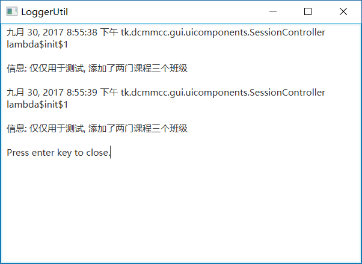
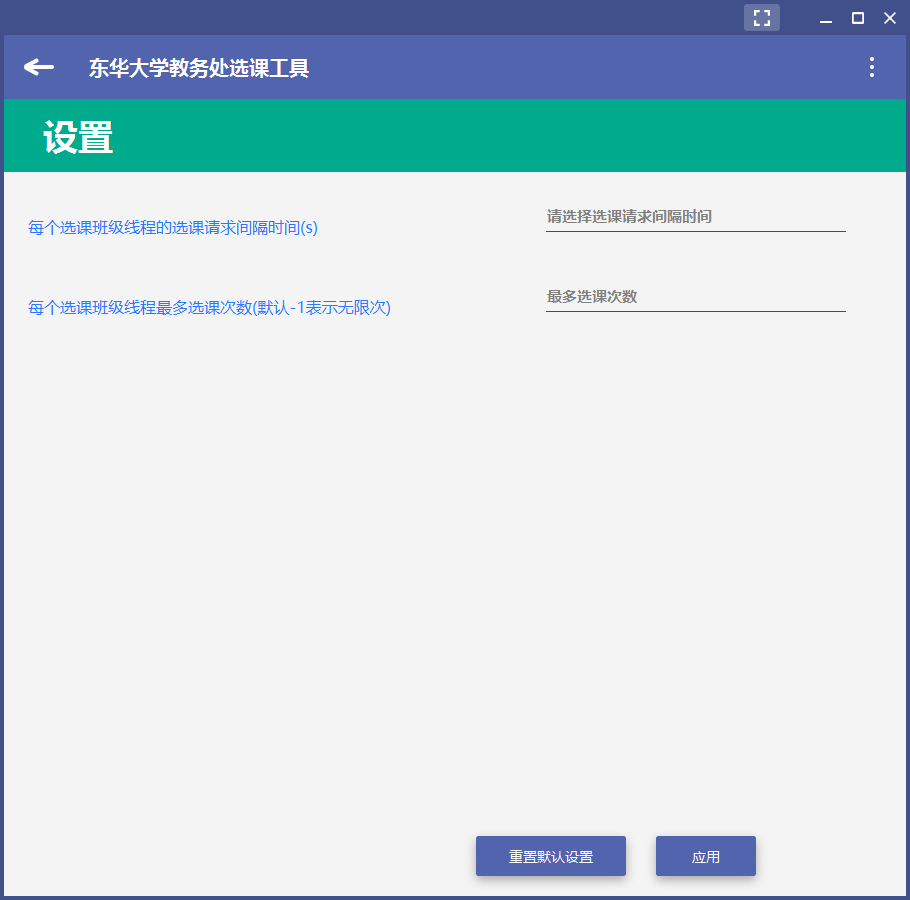
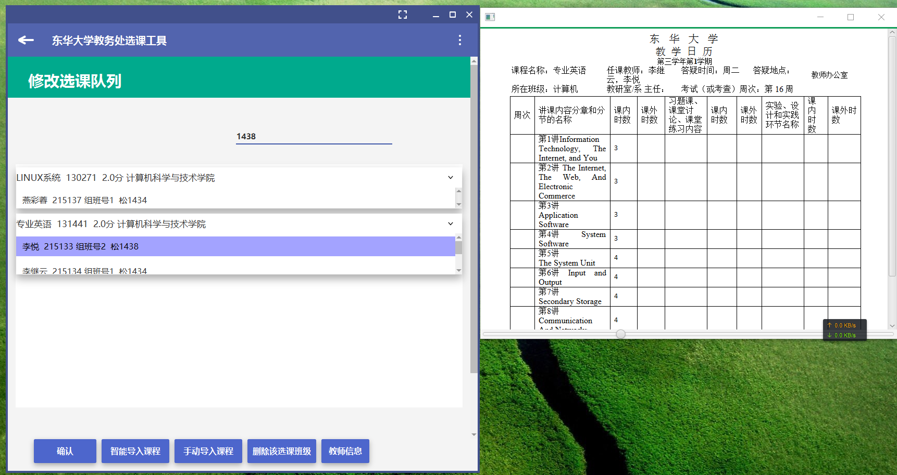
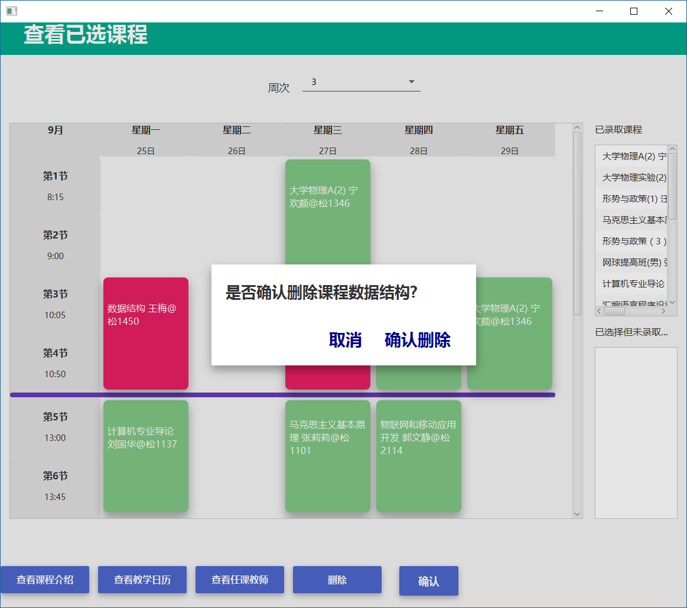

# DHUCourseSelecter


东华大学教务处选课助手 ver. 0.1 Alpha

> 09/30/17: 项目处于暂停状态, 将在下次开放选课的时候重启项目, 完成所有的TODOs

# Issues

OpenJDK not include JavaFX in Arch Linux (or other linux distrubutions), please install java-openjfx (AUR) or same packages in your linux distrubution.

# TODO List

* 智能导入课程(让用户按照类别和学分选课课程)
* 导入该课程下的班级: 用课表来可视化展示班级(课程下的班级分为不冲突和与其他已选班级冲突两部分), 让用户自行选择班级.
* 在修改选课界面, 点击课表的任意空白处, 可以找到队列中所以课程下面的所有班级中符合这个时间的班级
* 修改选课队列界面的ListView改成TableRowExpanderColumn(ControlsFX)
* UtilList界面实现按回车关闭窗口
* 把所有的System.out的输出改成logger输出
* 将CourseClassRequestQueue中的Timer重构成TimeLine
* 完善关于界面中的信息
* FIXME 在SessionController中课程队列的查询 startHbox里面的点击之后ListView都不会展开或者收起来
* FIXME 在SessionController中所有选课线程都结束的时候, 恢复那些disable的按钮
* ViewSelectedCoursesStage中冲突课程的那个ListView中的元素的点击绑定那些功能按钮
* ViewSelectedCoursesStage中冲突的课程的ListView里面的信息加入课程的在这一天的节次信息
* ViewSelectedCoursesStage中删课之后刷新页面
* FIXME ViewSelectedCoursesStage中假设为1 ~ 18周
* FIXME ViewSelectedCoursesStage中的这些JFXSnackBar是透明的, 有问题
* ViewSelectedCoursesStage中的开学第一周的第一天的日期应该手动在设置里面设置或者从服务器更新
* FIXME ViewSelectedCoursesStage中默认是5天13节课(其中多了两行用来作为午饭和晚饭时间, 还有第一列显示节次和时间)
* 处理各种Exception和出错情况
* ViewSelectedCoursesStage识别校区(从教务处读取)
* ViewSelectedCoursesStage中那些课程ListView中的元素, 鼠标放在Label上悬停就相当于点击操作
* FIXME iewSelectedCoursesStage中在显示PopOver的时候如果关闭窗口, 就会出现一堆错误....
* 实现后台运行
* 处理教务处系统卡炸了出现类似Service Unavailable之类的各种问题的情况
* DHUCurrentUser中添加开关是否确认选择有冲突的课程

# Changelog

* v0.1.0 Alpha 所有功能已经封装在了`libDHUCourseSelecter`这个库里面了, CLI测试程序已经完成, GUI方面除了修改选课之外都差不多完善好了.

> Still coding...

# Features

* 已选课程课表预览
* 自定义选课请求的间隔时间和最大选课次数
* 多线程选课, 并且可以使用Listener
* 从教务处选课首页导入当前学期推荐选择的课程
* 搜索课程
* 封装了大类课程, 课程, 班级的各类信息
* 查看已选课程
* 删除课程
* 查看日志

# Screenshot

**关于界面(未完成)**

.png)

**查看日志**



**设置界面**



**修改选课队列**



**查看已选课程的课表**



# Dependent Libraries

*向开源致敬*

* [HttpClient](https://hc.apache.org/httpclient-3.x/)
* [Jsoup](https://jsoup.org/)
* [io.datafx]()
* [controlsfx]()
* [tilesfx]()
* [httpclient]()

# Build

本项目用Gradle构建, 要运行GUI主程序, 请在项目根目录执行: 

Windows下:

```
$ gradlew run
```

*nix下:

```
$ ./gradlew.sh run
```

or 

```
$ gradle run
```

if you have local Gradle distribution in your OS.

其他`tasks`请执行`gradlew tasks`查看.

# Author

[DCMMC](http://blog.dcmmcc.tk)

# License

[GPL v2](./LICENSE)
